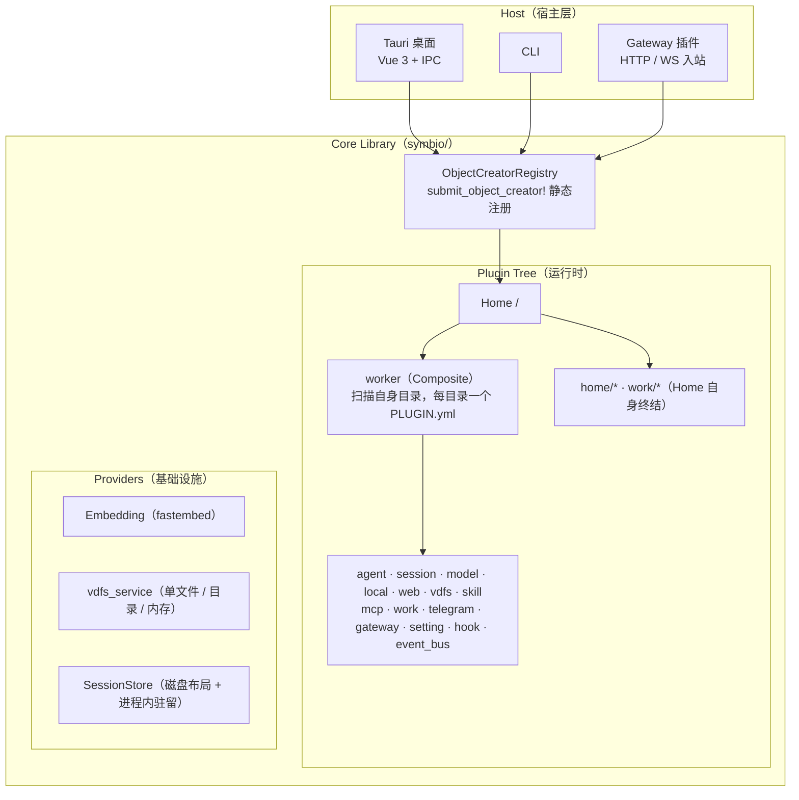
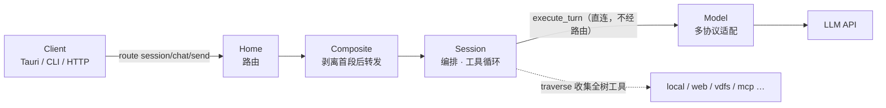

# Symbio 系统地图

> **文档类型：导航** — 一图胜千言，快速定位系统全貌。
> 本文件只画**结构与分层**；插件 × 挂载点 × 路由 × 工具的权威清单见 [CURRENT.md](./CURRENT.md)，文档索引见 [docs/README.md](./README.md#快速导航)。

## 系统边界

> 插件清单（16 个）、各插件注册名 / VDFS 挂载点 / 自有路由 / 配置文件，见 [CURRENT.md](./CURRENT.md) §1。

## 请求流转（以 AI 对话为例）

> 完整链路、流式帧与代码位置见 [DATA_FLOW.md](./architecture/DATA_FLOW.md)。

## 协议栈

| 层级 | 类型 | 用途 |
|------|------|------|
| **帧** | `PluginFrame` | 通道最小消息单位 (Data / Error) |
| **载荷** | `PluginPayload` | route() 返回 (Empty/Data/Native/Session) |
| **通道** | `PluginChannel` | 全双工流式会话 (mpsc pair) |
| **路由** | `InvokeRequest` | 上下文注入 (PATH / PAYLOAD / WORKDIR ...) |

> 定义与不变量见 [PROTOCOLS.md](./architecture/PROTOCOLS.md)。

---

> **维护原则**：本文档是系统的"地图"，与代码同步；架构变更时必须同步更新此图。
