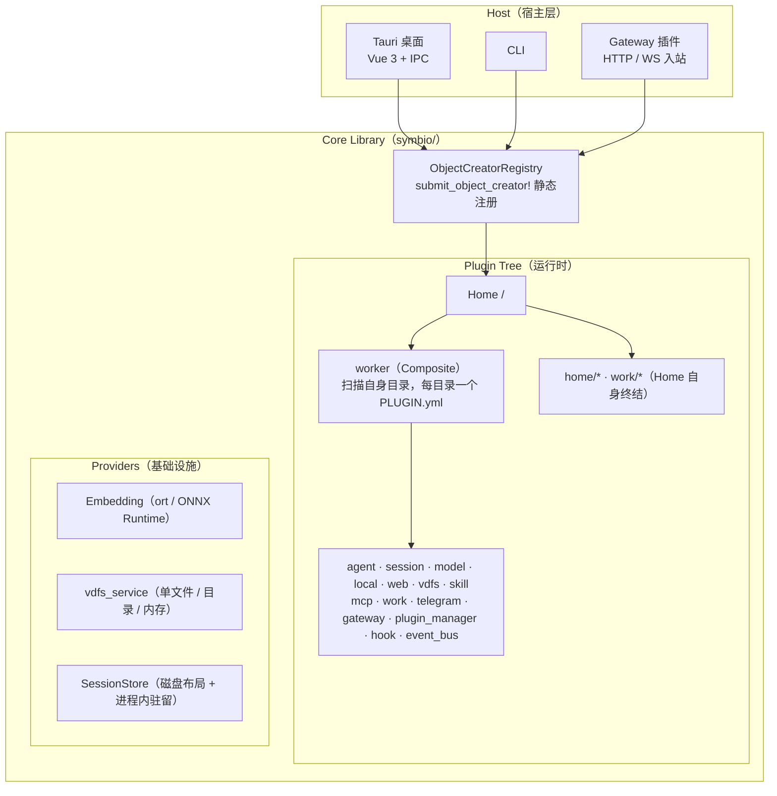

# Symbio 系统地图

> **文档类型：导航** — 一图胜千言，快速定位系统全貌。
> **本文是「谁挂在谁下面」的唯一 owner**（运行时拓扑）。其它文档画树一律引用本文。
> 插件 × 挂载点 × 路由 × 工具的权威清单见 [CURRENT.md](./CURRENT.md)；
> 逻辑分层与设计取舍见 [architecture/OVERVIEW.md](./architecture/OVERVIEW.md)；
> 文档索引见 [docs/README.md](./README.md#快速导航)。

## 系统边界

> 插件清单（16 个）、各插件注册名 / VDFS 挂载点 / 自有路由 / 配置文件，见 [CURRENT.md](./CURRENT.md) §1。

## 请求流转与协议栈

两者都不在本文重复：
**一次请求从入口到出口经过哪些代码**（含排障锚点）见 [DATA_FLOW.md](./architecture/DATA_FLOW.md)；
**帧 / 载荷 / 通道 / 线格式的准确规格**见 [PROTOCOLS.md](./architecture/PROTOCOLS.md)。

---

> **维护原则**：本文是系统拓扑的唯一 owner，拓扑变更（新增 / 移除 / 改挂载层级）时同步更新上图。
