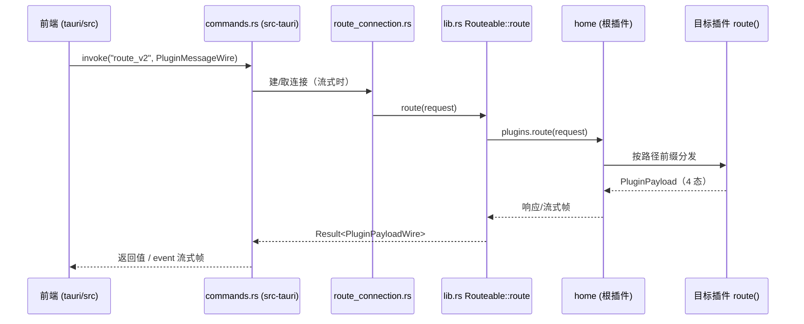

# 数据流与调用链（DATA_FLOW）

> **文档定位**：排障地图。回答"一次请求从入口到出口经过哪些代码"，让你**按图索骥定位问题，而不是大范围读源码**。
> 配套阅读：[OVERVIEW.md](./OVERVIEW.md)（为什么这样设计）、[PROTOCOLS.md](./PROTOCOLS.md)（协议约定）、[ROUTES.md](../reference/ROUTES.md)（路径清单）。

---

## 链路一：桌面端请求（route_v2，同步 + 流式）

| # | 环节 | 代码位置 | 说明 |
|---|------|---------|------|
| 1 | 前端发起 | `tauri/src/services/`（IPC 封装） | `invoke("route_v2", ...)`，载荷为 `PluginMessageWire` |
| 2 | Tauri 命令 | `tauri/src-tauri/src/commands.rs` | 仅 3 个命令：`route_v2` / `route_v2_send` / `route_v2_close` |
| 3 | 连接管理 | `tauri/src-tauri/src/route_connection.rs` | 流式连接的生命周期（send/close） |
| 4 | 核心库入口 | `symbio/src/lib.rs` → `Routeable::route` | `self.plugins.route(&request)` |
| 5 | 根组装 | `symbio/src/init.rs` → `create_root_plugin` | 根插件为 `home` |
| 6 | home 分发 | `symbio/src/plugins/home/plugin.rs` | 根插件 `home`：自身终结 `home/*`、`work/*`、`entities/providers`、`save_config`，其余转发 `worker` |
| 7 | composite 分发 | `symbio/src/plugins/composite/` | `worker`（Composite）按 `config.yaml` 的 `symbio.plugins` 挂载**全部**子插件：`agent` / `session` / `model` / `local` / `web` / `skill` / `mcp` / `telegram` / `gateway` / `setting` / `hook` / `event_bus` |
| 8 | 插件处理 | 各插件 `plugin.rs` 的 `route()` | 路径清单见 [ROUTES.md](../reference/ROUTES.md) |
| 9 | 错误返回 | `symbio_core/error.rs` | 错误码对照 [ERROR_CODES.md](../reference/ERROR_CODES.md) |

**排障口诀**：路径不对 → 查 #6/#7 挂载与 [ROUTES.md]；载荷不对 → 查 [PROTOCOLS.md] 的 Wire 协议；错误码不明 → 查 #9。

## 链路二：LLM 流式对话（`session/chat/send`）

| # | 环节 | 代码位置 | 说明 |
|---|------|---------|------|
| 1 | 入口 | `symbio/src/plugins/session/plugin.rs` | **会话编排权归 session**（见 `chat_pipeline.rs` 头注释） |
| 2 | 能力收集 | `symbio/src/plugins/session/chat_pipeline.rs` | session 调 `collect_capabilities` → `parent.traverse(TRAVERSE_AVAILABLE_TOOLS)` 广播收工具；**agent 仅当 `ctx[AGENT_ID]` 存在时贡献**（不选 agent 的会话照常运行）；收集期错误通道（`report_error` / `take_errors`）在 `symbio_core/capability_error.rs` |
| 3 | 默认能力 | `symbio_core/tools.rs` | `DefaultToolVisitor`（从 agent 内部上浮的公共实现） |
| 4 | 模型调用 | `symbio/src/plugins/model/plugin.rs` | 4 协议适配：OpenAI / Anthropic / Gemini / Ollama |
| 5 | 工具循环 | `model` 内 tool loop | 工具实现方：`local` / `web` / `telegram` 等 |
| 6 | 流式帧推送 | `symbio_core/event_bus.rs` + `plugins/event_bus/` | session → EventBus → 前端订阅 |
| 7 | 会话持久化 | `plugins/session/`（存储层） | 帧格式见 [PROTOCOLS.md]「AI 会话流式规范」 |

**排障口诀**：不出字 → 查 #4 协议适配与 provider 配置；工具不触发 → 查 #2 收集结果与 #5 循环；前端收不到帧 → 查 #6 EventBus 订阅。

## 链路三：HTTP/WS 入站（gateway 插件）

| # | 环节 | 代码位置 | 说明 |
|---|------|---------|------|
| 1 | 监听 | `plugins/gateway/server.rs` | `POST /api/v1/invoke`（同步）、`WS /api/v1/ws`（双向）、`GET /api/v1/health` |
| 2 | 鉴权 | `plugins/gateway/config.rs` | 非回环地址需 `inbound_token`；回环免鉴权 |
| 3 | 同构调用 | gateway → `parent.route()`（父级为 `worker` Composite，等价于既有 `root.route`） | 载荷与 route_v2 完全同构（`PluginMessageWire`）；`gateway/*` 自身接口恒走 native |
| 4 | 设计沿革 | [design/http-api-transport.md](../design/http-api-transport.md) | 设计稿（已实现落地） |

**排障口诀**：外部调不通 → 先 `GET /api/v1/health`，再查 #2 鉴权与监听地址。

## 通用：资源访问链路（`vdfs/*`，`.vdfs/<挂载点>/…`）

> `{plugin}/entities/*` 已于 S11 下线（协议），实体机制退为**内部抽象**：
> 由 `vdfs::EntityVdfsAdapter` 把 `EntityProvider` 适配成 VDFS 挂载点。

| # | 环节 | 代码位置 | 说明 |
|---|------|---------|------|
| 1 | 协议入口 | `plugins/vdfs`（`host.rs` 分发 + `protocol.rs` 载荷） | 14 个操作：providers / list / tree / stat / read / write / mkdir / delete / move / watch / unwatch / action … |
| 2 | 挂载点来源 | `provider_registry()`（经 `EntityVdfsAdapter`）与各插件自持的 `VdfsProvider` | 挂载名即 kind；能力来自访问位 + `supports_upload` / `supports_import` |
| 3 | 机制详解 | [design/vdfs.md](../design/vdfs.md)、[design/vdfs-frontend.md](../design/vdfs-frontend.md) | 机制规范与前端页面规范；内部实体机制见 [design/entity-management-mechanism.md](../design/entity-management-mechanism.md) |

## 全链路追踪

- `trace_id` 贯穿 Wire 协议（见 [PROTOCOLS.md]），日志排查时先对齐 trace_id。
- 日志位置与级别见 [CONFIGURATION.md](../reference/CONFIGURATION.md)。

## 排障锚点速查

| 症状 | 首查 |
|------|------|
| 路由 404 / UNKNOWN_PATH | [ROUTES.md] + home/composite 挂载（链路一 #6/#7） |
| 聊天无响应/不出字 | 链路二 #4（协议适配）、provider 配置 |
| 工具不执行 | 链路二 #2（能力收集）、#5（工具循环） |
| 流式帧丢失 | 链路二 #6（EventBus 订阅）、链路一 #3（连接生命周期） |
| 外部 HTTP 调用失败 | 链路三 #1/#2（health → 鉴权） |
| 实体增删查异常 | 通用实体链路 #1/#2 + [entity-management-mechanism] |
| 错误码含义 | [ERROR_CODES.md]（源：`symbio_core/error.rs`） |
| 配置不生效 | [CONFIGURATION.md] + `setting` 插件（`setting/list`、`setting/get`） |

---

*维护规则：调用链变更时同步更新本文件（对应环节的"代码位置"列）；新增链路（如新的入站通道）时新增章节。*
