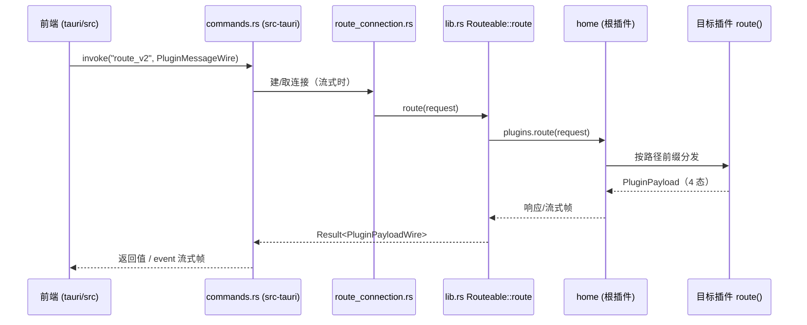

# 数据流与调用链（DATA_FLOW）

> **文档定位**：排障地图。回答"一次请求从入口到出口经过哪些代码"，让你**按图索骥定位问题，而不是大范围读源码**。
> 配套阅读：[OVERVIEW.md](./OVERVIEW.md)（为什么这样设计）、[PROTOCOLS.md](./PROTOCOLS.md)（协议约定）、[ROUTES.md](../reference/ROUTES.md)（路径清单）。

---

## 链路一：桌面端请求（route_v2，同步 + 流式）

| # | 环节 | 代码位置 | 说明 |
|---|------|---------|------|
| 1 | 前端发起 | `tauri/src/services/`（IPC 封装） | `invoke("route_v2", ...)`，载荷为 `PluginMessageWire` |
| 2 | Tauri 命令 | `tauri/src-tauri/src/commands.rs` | 仅 3 个命令：`route_v2` / `route_v2_send` / `route_v2_close` |
| 3 | 连接管理 | `tauri/src-tauri/src/route_connection.rs` | 流式连接的生命周期（send/close） |
| 4 | 核心库入口 | `symbio/src/lib.rs` → `Routeable::route` | `self.plugins.route(&request)` |
| 5 | 根组装 | `symbio/src/init.rs` → `create_root_plugin` | 根插件为 `home` |
| 6 | home 分发 | `symbio/src/plugins/home/plugin.rs` | 根插件 `home`：自身终结 `home/*`、`work/*`，其余转发 `worker` |
| 7 | composite 分发 | `symbio/src/plugins/composite/` | `worker`（Composite）**扫描自己的目录**（其下一层目录即一个插件，每个一个 `PLUGIN.yml`）挂载**全部**子插件：`agent` / `session` / `model` / `local` / `web` / `skill` / `mcp` / `telegram` / `gateway` / `setting` / `hook` / `event_bus`；清单由构造者经 `REQUIRED_PLUGINS` 传入，容器不内置 |
| 8 | 插件处理 | 各插件 `plugin.rs` 的 `route()` | 路径清单见 [ROUTES.md](../reference/ROUTES.md) |
| 9 | 错误返回 | `symbio_core/error.rs` | 错误码对照 [ERROR_CODES.md](../reference/ERROR_CODES.md) |

**排障口诀**：路径不对 → 查 #6/#7 挂载与 [ROUTES.md]；载荷不对 → 查 [PROTOCOLS.md] 的 Wire 协议；错误码不明 → 查 #9。

## 链路二：LLM 流式对话（`session/chat/send`）

| # | 环节 | 代码位置 | 说明 |
|---|------|---------|------|
| 1 | 入口 | `symbio/src/plugins/session/plugin.rs` | **会话编排权归 session**（见 `chat_pipeline.rs` 头注释） |
| 2 | 能力收集 | `symbio/src/plugins/session/chat_pipeline.rs` | session 调 `collect_capabilities` → `parent.traverse(TRAVERSE_AVAILABLE_TOOLS)` 广播收工具；**agent 仅当 `ctx[AGENT_ID]` 存在时贡献**（不选 agent 的会话照常运行）；收集期错误通道（`report_error` / `take_errors`）在 `symbio_core/capability_error.rs` |
| 3 | 默认能力 | `symbio_core/tools.rs` | `DefaultToolVisitor`（从 agent 内部上浮的公共实现） |
| 4 | 模型调用（单轮） | `symbio/src/plugins/model/bound_provider.rs` | `execute_turn` = **一次** LLM 调用：4 协议适配（OpenAI / Anthropic / Gemini / Ollama）+ SSE 解析 + 事件出口。`model` **不做轮次循环** |
| 5 | 工具循环（轮次） | `symbio/src/plugins/session/chat_loop.rs`（`close_turn` → `process_tool_calls_async`） | 「LLM → 工具 → LLM」的循环归 **session**（`gate_turn` / `close_turn` 判定下一步）。工具实现方：`local` / `web` / `vdfs` / `mcp` / `skill` / `telegram` / `agent` 等 |
| 6 | 前端显示 | `event_bus` 的 `KIND_VDFS` 变更（消费端先 `vdfs/watch` 登记） | **显示只由节点状态驱动**：消息是 `<根>/session/<id>/消息/<mid>` 这个**文件**，会话运行态是会话节点（`<根>/session/<id>`）的 `status`——两者都是 VDFS 变更。`updated` 带 `delta` = 尾部追加（零回读）；无 `delta` = 回读。顺序是**节点属性**（`ChatMessage.seq`），与到达顺序无关。见 [`session/docs/node-state-streaming.md`](../../symbio/src/plugins/session/docs/node-state-streaming.md) §5.1 与 §11 |
| 7 | 会话持久化 | `plugins/session/`（存储层） | 帧格式见 [PROTOCOLS.md]「AI 会话流式规范」 |

> **执行期的两个原语**（[ADR-020](../DECISIONS.md#adr-020-执行期与传输层分离eventsink出-abortsignal入取代-pluginchannel-的双职责)）：
> 执行层（LLM 单轮 / 工具调用）与宿主层之间**不走 `PluginChannel`**——出方向是
> `EventSink`（`Direct` 进程内直连转写唯一写入点 / `Null` 静默），入方向是
> `AbortSignal`（`abort()` 置位即唤醒，无帧、无轮询）。`PluginChannel` 只承担
> **跨进程传输**（前端实时面 `PluginPayload::Session`）。排障时：**帧通道里没有
> 中止帧**，中止只有一个入口 `AbortSignal::abort()`。

**排障口诀**：不出字 → 查 #4 协议适配与 provider 配置；工具不触发 → 查 #2 收集结果与 #5 循环；**状态不刷新** → 查 #6：`emit_session_state` 是否被调（运行态的**唯一出口**），以及前端对 `<根>/session/<id>` 的 `updated` 变更是否在收敛（运行态的**唯一通道**）；状态不动而消息正常 → 同上，多半是唯一出口漏调。

## 链路三：HTTP/WS 入站（gateway 插件）

| # | 环节 | 代码位置 | 说明 |
|---|------|---------|------|
| 1 | 监听 | `plugins/gateway/server.rs` | `POST /api/v1/invoke`（同步）、`WS /api/v1/ws`（双向）、`GET /api/v1/health` |
| 2 | 鉴权 | `plugins/gateway/config.rs` | 非回环地址需 `inbound_token`；回环免鉴权 |
| 3 | 同构调用 | gateway → `parent.route()`（父级为 `worker` Composite，等价于既有 `root.route`） | 载荷与 route_v2 完全同构（`PluginMessageWire`）；`gateway/*` 自身接口恒走 native |
| 4 | 设计沿革 | [design/http-api-transport.md](../design/http-api-transport.md) | 设计稿（已实现落地） |

**排障口诀**：外部调不通 → 先 `GET /api/v1/health`，再查 #2 鉴权与监听地址。

## 通用：资源访问链路（`vdfs/*`，`<根>/<子目录>/…`）

> `{plugin}/entities/*` 已于 S11 下线（协议）；VDFS 收敛期结束后，
> `EntityProvider` 抽象与 `EntityVdfsAdapter` 一并删除——**每个资源插件
> 直接实现 `VdfsProvider`**，中间不再有 trait 与适配器。其下的
> `providers/storage_service`（`StorageService` / `EntityStore`）与
> `symbio_core::entities` 存储原语随后也废除，落盘收敛为
> `providers/vdfs_service` 的三个集中实现（见 #4）。

| # | 环节 | 代码位置 | 说明 |
|---|------|---------|------|
| 1 | 协议入口 | `plugins/vdfs`（`host.rs` 分发 + `protocol.rs` 载荷） | 13 个操作：list / tree / stat / read / write / mkdir / delete / move / edit / search / watch / unwatch / action |
| 2 | 地址分流 | `plugins/vdfs/fs.rs`（`UnifiedFs`） | `<根>` 独占首段 → 虚拟层（容器组合视图）；其余 → 物理层 `physical.rs`（工作目录 / 绝对路径的真实文件） |
| 3 | 子目录来源 | `plugins/composite/vdfs.rs` 逐子插件收集，委派给各插件自持的 `impl VdfsProvider` | 子目录名 = 插件名（约定，由注册方选定）；能力只来自访问位 `r` / `w` / `l` / `t` |
| 4 | **落盘在哪一层** | `providers/vdfs_service`（`DirVdfs` / `SingleFileVdfs` / `MemoryVdfs` + `entry.rs` / `pack.rs`） | 虚拟层再往下的一跳：条目寻址与原子落盘（`<homedir>/<类别>/<id>/<manifest>`）、整包 zip / base64、变更广播。**不在** core 协议层，也**不走** `create_object` 工厂。目录自管的资源（agent 目录走 `AgentDirStore`、session 走自己的 `SessionStore`）不进这一层 |
| 5 | 机制详解 | [design/vdfs.md](../design/vdfs.md)（§11 / §13.4）、[design/vdfs-frontend.md](../design/vdfs-frontend.md) | 机制规范与前端页面规范 |

**排障口诀**：列不出 / 读不到 → 查 #2 地址分流与 #3 收集结果；写盘没生效 / 前端不刷新
→ 查 #4（`vdfs_service` 的写入与 `notify_change` 广播）；物理路径被拒 → 查 #2 的 `FsPolicy`。

## 全链路追踪

- `trace_id` 贯穿 Wire 协议（见 [PROTOCOLS.md]），日志排查时先对齐 trace_id。
- 日志位置与级别见 [CONFIGURATION.md](../reference/CONFIGURATION.md)。

## 排障锚点速查

| 症状 | 首查 |
|------|------|
| 路由 404 / UNKNOWN_PATH | [ROUTES.md] + home/composite 挂载（链路一 #6/#7） |
| 聊天无响应/不出字 | 链路二 #4（协议适配）、provider 配置 |
| 工具不执行 | 链路二 #2（能力收集）、#5（工具循环） |
| 流式帧丢失 | 链路二 #6（`event_bus` 满通道补送 resync 指令 → 按作用域整份重读）、链路一 #3（连接生命周期） |
| 会话状态不刷新（角标/停止按钮不动） | 链路二 #6：`emit_session_state` 是否被调（运行态的唯一出口）；前端对 `<根>/session/<id>` 的 `updated` 变更是否在收敛（运行态的唯一通道） |
| 外部 HTTP 调用失败 | 链路三 #1/#2（health → 鉴权） |
| 资源增删查异常 | 通用：资源访问链路（`vdfs/*`）#2/#3/#4 + [design/vdfs.md](../design/vdfs.md) §13.4 + `symbio/src/providers/vdfs_service/` |
| 错误码含义 | [ERROR_CODES.md]（源：`symbio_core/error.rs`） |
| 配置不生效 | [CONFIGURATION.md] + `setting` 插件（`<根>/setting` 的 `vdfs/list` / `vdfs/read`） |

---

*维护规则：调用链变更时同步更新本文件（对应环节的"代码位置"列）；新增链路（如新的入站通道）时新增章节。*
