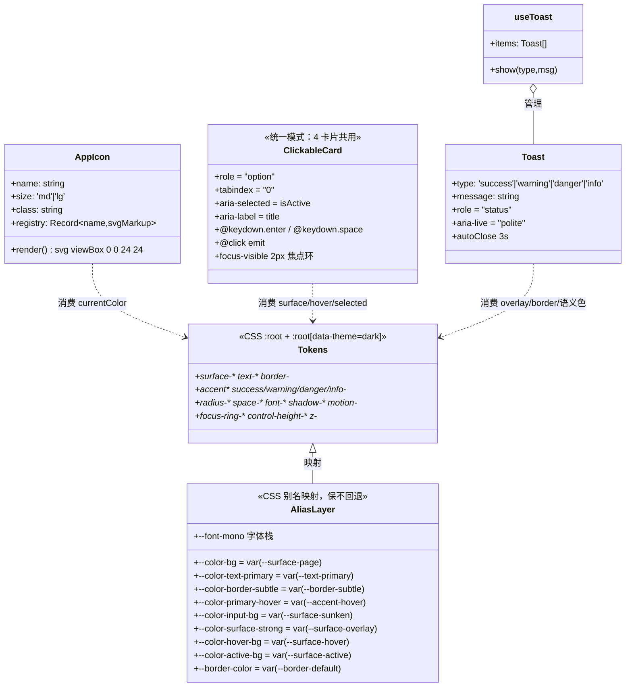
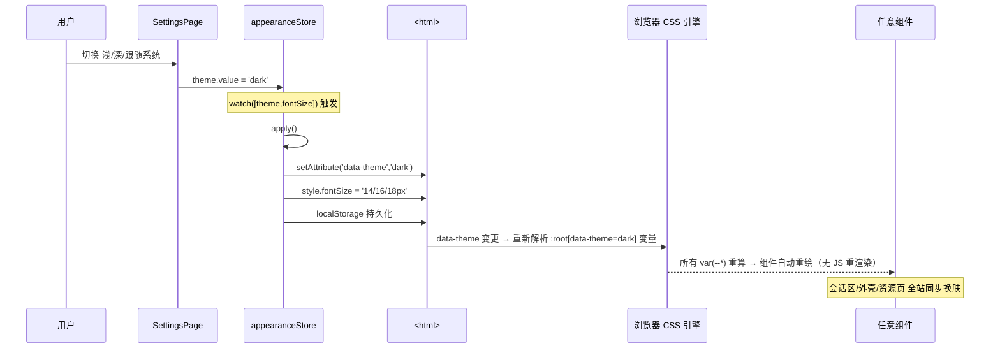
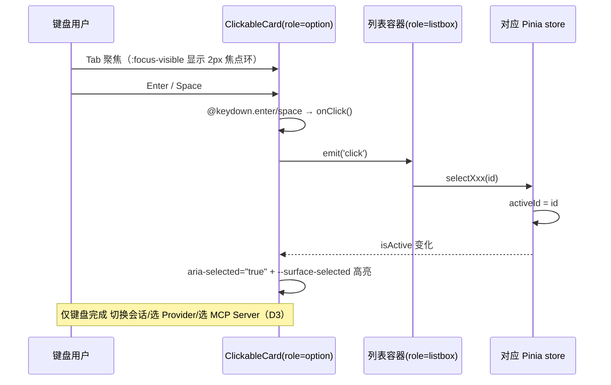
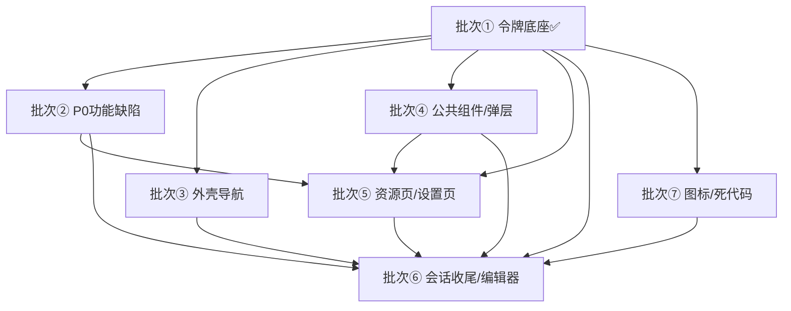

# Symbio 前端 App 整体 UI/UX 系统化优化 — 系统设计与任务分解

| 项目 | 内容 |
| --- | --- |
| 文档语言 | 简体中文 |
| 项目名 | `symbio_frontend_ui_ux_systematization` |
| 技术栈 | Vue 3 (SFC) + Pinia + vue-router + Vite + Tauri 2 **桌面应用** |
| 前端根目录 | `D:\Bing\symbio\tauri`（下文 `文件:行` 相对 `src/`） |
| 输入 | `frontend-ui-ux-prd-2026-09-02.md`（PRD v1.0） |
| 版本 | v1.0（2026-09-02） |
| 作者 | 高见远（架构师） |
| 状态 | 设计完成，待工程师按批次实现 |

> 本设计基于**实际读文件取证**（见 §0 取证清单），所有结论均可回溯到具体 `文件:行`。会话区已完成改造**零回退**：新增令牌层通过**别名映射**兼容既有 `--color-*`，不删除、不改其语义。

---

## 0. 取证清单（架构师复核）

| 复核项 | 结论 | 证据 |
| --- | --- | --- |
| 令牌底座 / 全局基础样式 | **已落地（批次①完成）** | `src/styles/tokens.css`（274 行，含别名层）、`src/styles/base.css`（60 行，全局焦点环 + 滚动条令牌化）、`src/main.ts:6-7` 已 `import` 两文件 |
| `--color-text-primary` 无 fallback（真坏） | 3 处裸引用，现由别名层补齐 | `HomedirSwitcher.vue:239/275/306` |
| 其余 4 个未定义令牌带浅色 fallback | 已通过别名层补齐真实值 | `tokens.css:160,167,172`（border-subtle / primary-hover / border-color） |
| `--border-color` 仅出现在死代码 | 仅 `ExplorerPage.vue:655/744`；该文件在删除清单，故**不强行补**，别名层已顺带定义（`tokens.css:172/273`） | grep 全仓 `--border-color` 仅 3 处命中（均 ExplorerPage/tokens 注释） |
| `--font-mono` 高收益低成本 | 已被 6 文件引用，现定义一次全站生效 | `tokens.css:71-72`；引用方 `McpView/McpServerSettings/ModelProviderCard/ModelProvidersSettings/McpServerCard` |
| 状态点同色（McpServerCard） | 基类 `#94a3b8` 与 `.failed` 同为 `#94a3b8`，仅 `.running` 为 `#22c55e` | `McpServerCard.vue:150/155/160-161` |
| `SettingsPage.vue:115` `\u` 字面量 | Vue 模板不解码 `\uXXXX`，原样显示 | 全仓 grep `\\u` → 含 4 处**活模板 bug**（见 §3.4.2） |
| 键盘可达性 | 仅 11 个 `.vue` 文件含 `focus-visible\|:focus\|tabindex\|aria-label\|role=`；4 个可点击卡片（`ResourceCard/SessionCard/ModelProviderCard/McpServerCard`）**零命中** | grep `focus-visible\|:focus\|tabindex\|aria-label\|role=` |
| 死代码零引用 | `ExplorerPage/FloatingInput/CodeBlockExecutor/Diagnostic` 全仓零 import / 零动态引用 / 零路由 | grep 四文件名 → No matches |
| 主题切换机制 | `appearance.ts:apply()` 写 `<html data-theme>` + `<html>` fontSize；`watch([theme,fontSize])` 即时重绘 | `stores/appearance.ts:59-74` |
| 路由（6 入口） | `session / model-providers / mcp / skill / agent / settings` + `/file-viewer` | `router/index.ts:9-26` |

---

## 1. 实现方案与选型论证

### 1.1 核心难点与选型

| 难点 | 选型 | 理由 |
| --- | --- | --- |
| 299 处硬编码色 / 81 处 `rgba(0,0,0,…)` / 5 未定义令牌 / 4 深色专用令牌 | **新增全局基础样式表**（`tokens.css` + `base.css`），由 `main.ts` 引入 | 不引入任何新 UI 框架 / 组件库 / CSS 框架（硬约束）；纯 Vue 3 + 原生 CSS 自定义属性即可实现 100% 令牌化 |
| 会话区已改造不可回退 | **令牌分层 + 别名映射层** | 旧 `--color-*` 以 `var(--新语义令牌)` 重新声明，迁移期旧代码不破版 |
| 140 处 emoji 与 inline SVG 混用 | **单组件图标注册表 `AppIcon.vue`**（Q3 选 B：仅替换 UI 控件类图标，文件类型 emoji 保留） | 单文件零依赖、统一 16/20px 两档与 `stroke` 规格；不新增 npm 包 |
| 三栏 `flex:0 0` 永不收缩 | **响应式断点（1100/900px）+ 手动折叠开关**（Q9 选 B） | 不依赖拖拽库；复用现有 `compact` 思路 |
| 4 份 Toast / 5 份状态点 / 8 处原生弹窗 | **抽取 1 个全局组件 + 1 套约定** | 收敛视觉语言，满足 G2 |
| 键盘不可达（focus-visible 0%） | **全局 `:focus-visible` 焦点环（base.css）+ 可点击卡片统一模式** | 零依赖、覆盖 100% 可聚焦元素 |

### 1.2 是否新增全局基础样式表（职责边界）

**新增** `src/styles/tokens.css` 与 `src/styles/base.css`（批次①已完成），由 `main.ts:6-7` 在挂载前 `import`（位于 `App.vue` 之前，确保令牌先于组件解析）。

| 层 | 文件 | 职责 | 允许内容 |
| --- | --- | --- | --- |
| **令牌层** | `tokens.css` | 单一令牌来源：浅色 `:root` + 深色 `:root[data-theme="dark"]` 各一套语义令牌 + 别名映射层 | 仅 `:root`/`:root[data-theme="dark"]` 的自定义属性声明，**零选择器、零样式规则** |
| **全局基础层** | `base.css` | 全局副作用样式 | `:focus-visible` 焦点环、`::-webkit-scrollbar` 令牌化、表单字体继承、`prefers-reduced-motion` |
| **组件层** | 各 `.vue` 的 `scoped <style>` | 组件视觉令牌化 | 仅消费令牌（`var(--*)`），**禁止硬编码色值 / px 字号 / rgba(0,0,0,…)**；`App.vue` 的 `<style>`（非 scoped）仅保留 reset + `font-size:0.875rem` 基准 |

> `App.vue` 现状 `App.vue:11-40` 仅含 reset + `:root{font-size:.875rem}` + body 基础，无需改动（基准字号保持「中」档观感）。

### 1.3 令牌分层（三层）

```
┌─────────────────────────────────────────────────────────────┐
│ 基础层 tokens.css                                            │
│  :root { --surface-* --text-* --border-* --accent*           │
│          --success/warning/danger/info-* --radius-*          │
│          --space-* --font-* --shadow-* --motion-*            │
│          --focus-ring-* --control-height-* --z-* }           │
│  :root[data-theme="dark"] { 同上深色覆盖 }                    │
└─────────────────────────────────────────────────────────────┘
                         │ 映射（保证不回退）
                         ▼
┌─────────────────────────────────────────────────────────────┐
│ 兼容别名层 tokens.css（同文件底部）                            │
│  --color-bg → var(--surface-page)                            │
│  --color-text-primary → var(--text-primary)  ← 补齐(原无)    │
│  --color-border-subtle → var(--border-subtle)  ← 补齐       │
│  --color-primary-hover → var(--accent-hover)    ← 补齐       │
│  --color-input-bg → var(--surface-sunken)       ← 补齐浅色  │
│  ...（共 18 条，含 5 未定义 + 4 深色专用）                    │
└─────────────────────────────────────────────────────────────┘
                         │ 消费
                         ▼
┌─────────────────────────────────────────────────────────────┐
│ 组件层 各 .vue scoped <style>                                 │
│  .btn { background: var(--accent); color: var(--text-on-accent) }│
│  .card:hover { background: var(--surface-hover); }           │
└─────────────────────────────────────────────────────────────┘
```

### 1.4 完整浅 / 深两套具体值表（设计系统基准）

> 已落地于 `tokens.css`，此处为权威快照。验收时 `grep` 实际值须与下表一致。

**表面 `--surface-*`（替代 `--color-bg/-surface/-input-bg/-surface-strong`）**

| 令牌 | 浅色 | 深色 | 用途 |
| --- | --- | --- | --- |
| `--surface-page` | `#f6f7f9` | `#16161d` | 页面底 |
| `--surface-panel` | `#ffffff` | `#1c1c25` | 侧栏/面板/详情 |
| `--surface-card` | `#ffffff` | `#23232e` | 卡片/列表项 |
| `--surface-sunken` | `#f0f2f5` | `#101017` | 输入框/代码块 |
| `--surface-overlay` | `#ffffff` | `#23232e` | 对话框/菜单/Toast |
| `--surface-hover` | `rgba(15,23,42,0.05)` | `rgba(255,255,255,0.06)` | hover 叠加 |
| `--surface-active` | `rgba(15,23,42,0.09)` | `rgba(255,255,255,0.10)` | active 叠加 |
| `--surface-selected` | `rgba(79,70,229,0.08)` | `rgba(129,140,248,0.14)` | 选中底色 |

**文本 `--text-*`（修正 C1/C2/C3/C4）**

| 令牌 | 浅色 | 深色 | 对比度（on surface） |
| --- | --- | --- | --- |
| `--text-primary` | `#181c25` | `#e6e8ee` | ≥13:1 ✅ |
| `--text-secondary` | `#4b5563` | `#a2aab8` | ≥7:1 ✅ |
| `--text-muted` | `#6b7280` | `#7c8595` | 浅 4.83 / 深 4.54 ✅（原 #999 2.85 ❌） |
| `--text-disabled` | `#9aa3b0` | `#5a616f` | 豁免 |
| `--text-inverse` | `#ffffff` | `#16161d` | — |
| `--text-on-accent` | `#ffffff` | `#16161d` | 浅 6.29 / 深 6.04 ✅（原 3.66 ❌） |

**描边 `--border-*`**

| 令牌 | 浅色 | 深色 |
| --- | --- | --- |
| `--border-subtle` | `#eceef2` | `#262632` |
| `--border-default` | `#dfe3ea` | `#333343` |
| `--border-strong` | `#c6ccd8` | `#454558` |

**强调 / 语义色（Q7 主色 `#667eea → #4f46e5`）**

| 令牌 | 浅色 | 深色 |
| --- | --- | --- |
| `--accent` | `#4f46e5` | `#818cf8` |
| `--accent-hover` | `#4338ca` | `#a5b4fc` |
| `--accent-active` | `#3730a3` | `#c7d2fe` |
| `--accent-subtle-bg` | `rgba(79,70,229,0.10)` | `rgba(129,140,248,0.16)` |
| `--accent-subtle-border` | `rgba(79,70,229,0.30)` | `rgba(129,140,248,0.40)` |
| `--success-fg/bg/solid` | `#15803d / #ecfdf3 / #16a34a` | `#6ee7a8 / #10281c / #22c55e` |
| `--warning-fg/bg/solid` | `#b45309 / #fffbeb / #f59e0b` | `#fcd34d / #2a2109 / #f59e0b` |
| `--danger-fg/bg/solid` | `#b91c1c / #fef2f2 / #dc2626` | `#fca5a5 / #2a1618 / #ef4444` |
| `--info-fg/bg/solid` | `#1d4ed8 / #eff6ff / #3b82f6` | `#93c5fd / #0f2035 / #3b82f6` |

**圆角 / 间距 / 字体 / 阴影 / 焦点环 / 层级**（16→6 档圆角；14→3 档 gap；px→rem）

| 组 | 浅/深一致值 |
| --- | --- |
| `--radius-*` | `xs 3 / sm 4 / md 6 / lg 8 / xl 12 / full 999` |
| `--space-*` | `0 / 05 0.125 / 1 0.25 / 2 0.5 / 3 0.75 / 4 1 / 5 1.5 / 6 2`（rem） |
| `--font-size-*` | `xs 0.6875 / sm 0.75 / base 0.875 / md 1 / lg 1.125 / xl 1.25 / 2xl 1.5`（rem，禁止 <11px） |
| `--font-weight-*` | `regular 400 / medium 500 / semibold 600 / bold 700` |
| `--line-height-*` | `tight 1.35 / normal 1.5 / relaxed 1.6` |
| `--shadow-*` | `浅: --shadow-1 0 1px 2px rgba(16,24,40,.06); --shadow-2 0 8px 24px rgba(16,24,40,.12)` / `深: --shadow-1 none; --shadow-2 0 8px 24px rgba(0,0,0,.5)` |
| `--motion-*` | `fast 120 / base 160 / slow 240 ms` + `--motion-ease` |
| `--focus-ring-*` | `width 2 / offset 2 / color var(--accent)` |
| `--control-height-*` | `sm 24 / md 28 / lg 32`；`--hit-target-min 24` |
| `--z-*` | `overlay 1000 / dialog 1500 / toast 2000 / tooltip 2500`（集中常量） |

### 1.5 旧 `--color-*` → 新令牌 逐一对映射表

> 别名层（`tokens.css:156-173` 浅 / `257-273` 深）保证**旧代码零改动即生效**。✅=已在批次①补齐。

| 旧令牌（会话区/既有代码使用） | 新语义令牌 | 状态 | 备注 |
| --- | --- | --- | --- |
| `--color-bg` | `--surface-page` | 已有 | — |
| `--color-surface` | `--surface-panel` | 已有 | — |
| `--color-border` | `--border-default` | 已有 | — |
| `--color-text` | `--text-primary` | 已有 | — |
| `--color-text-secondary` | `--text-secondary` | 已有 | — |
| `--color-text-muted` | `--text-muted` | 已有 | — |
| `--color-primary` | `--accent` | 已有 | — |
| `--color-primary-dark` | `--accent-hover` | 已有 | — |
| `--color-text-primary` | `--text-primary` | ✅补齐 | 原无 fallback → 破版，最高优先级（HomedirSwitcher:239/275/306） |
| `--color-border-subtle` | `--border-subtle` | ✅补齐 | 原 fallback `rgba(0,0,0,0.04)` 深色语义错 |
| `--color-primary-hover` | `--accent-hover` | ✅补齐 | 原 fallback `#4338ca` |
| `--color-input-bg` | `--surface-sunken` | ✅补齐浅色 | 原仅深色定义 |
| `--color-surface-strong` | `--surface-overlay` | ✅补齐浅色 | 原仅深色定义 |
| `--color-hover-bg` | `--surface-hover` | ✅补齐浅色 | 原仅深色定义 |
| `--color-active-bg` | `--surface-active` | ✅补齐浅色 | 原仅深色定义 |
| `--border-color` | `--border-default` | ✅顺带补齐 | 仅 ExplorerPage:655/744 使用（该文件将删除） |
| `--font-mono` | `--font-mono` | ✅补齐 | 纯字体栈，与主题无关，定义一次全站生效 |
| `--color-code-bg/fg` | `--color-code-bg/fg` | 保留 | 会话区已定义（浅 `#0f172a` / 深 `#11111b`） |

### 1.6 图标组织方式

**方案：`src/components/common/AppIcon.vue`（单组件 + 路径注册表）**，零依赖、不引入图标库。

```
src/components/common/
├── AppIcon.vue      ← 渲染组件：<AppIcon name="settings" :size="20" />
└── icons.ts         ← 图标注册表：name → 内部 SVG 标记字符串
```

- `AppIcon.vue` 接收 `name` / `size`（`'md'=16` 控件内、`'lg'=20` 导航）/ `class`，渲染
  `<svg viewBox="0 0 24 24" :width :height fill="none" stroke="currentColor" stroke-width="2" stroke-linecap="round" stroke-linejoin="round" v-html="registry[name]" />`
- 注册表存**静态受信**的内联标记（路径/圆/线/矩形），`v-html` 仅用于自有常量，无 XSS 风险。
- **统一规格**：16px（控件内）/ 20px（导航）两档；`stroke-width=2` + `linecap/linejoin=round`（修复 `ResourceShell` 缺 linecap、`ChatMainPanel` 14px、`ChatContextBar` 13px 等 4 种尺寸不一）。
- **齿轮图标**（TOP1）：`MainLayout.vue:79` path 几何错误 → 在注册表内置**标准 Feather `settings` path** 整体替换（见 §3.3）。
- **emoji 替换范围（Q3-B）**：仅替换 UI 控件类 emoji（导航/按钮/状态/✨📄📍🗑✓✗⚠♥×），文件类型 emoji（FileTreeNode/ExplorerPage）保留。`×`/`♥` 文本字符改为 SVG 或保留为语义字符（视场景）。

### 1.7 响应式断点 + 折叠交互（解决三栏硬伤）

**现状硬伤**：`SessionView.vue:41-56` 两侧 `flex:0 0 260px/280px`（shrink=0、grow=0）→ 永不收缩；700px 时中间仅 160px。`flex-shrink:0` 等价于 `flex: 0 0`。

**设计（Q9-B：断点 + 手动折叠）**：

```css
/* 默认：允许收缩，设下限，避免 0 收缩 */
.col-left  { flex: 0 1 260px; min-width: 200px; max-width: 360px; }
.col-right { flex: 0 1 280px; min-width: 200px; max-width: 420px; }

/* ≤1100px：右栏可手动折叠为图标轨（SessionExplorerPanel 头部折叠按钮切换 .collapsed） */
@media (max-width: 1100px) {
  .col-right.collapsed { flex: 0 0 44px; min-width: 44px; }
}
/* ≤900px：左栏（会话列表）抽屉化覆盖（MainLayout/SessionView 提供汉堡开关） */
@media (max-width: 900px) {
  .col-left  { position: absolute; z-index: var(--z-overlay); height: 100%;
               box-shadow: var(--shadow-2); }
  .col-left:not(.open) { transform: translateX(-100%); }
}
```

- 折叠开关：`SessionExplorerPanel.vue` 头部加 `◧` 折叠按钮 → toggle `collapsed`；`SessionListPanel` 头部加汉堡 → toggle `open`（仅在 ≤900px 显示）。
- 不引入拖拽库（Q9 选 B，方案 C 可拖拽列为 P2，见 R50）。
- 侧边栏宽度改用 `var(--sidebar-width)`（已定义 48px；若 Q2 选加文字标签则改 72/176px，配合 `--sidebar-width` 令牌一处改全站）。

---

## 2. 文件清单（新增 / 修改 / 删除，相对 `src/`）

### 2.1 新增文件

| 相对路径 | 批次 | 说明 |
| --- | --- | --- |
| `styles/tokens.css` | ①✅ | 语义令牌 + 别名层（已落地） |
| `styles/base.css` | ①✅ | 全局焦点环 + 滚动条 + 减少动效（已落地） |
| `components/common/AppIcon.vue` | ⑦ | 统一图标渲染组件 |
| `components/common/icons.ts` | ⑦ | 图标路径注册表（含标准 Feather 齿轮 path） |
| `components/common/Toast.vue` | ④ | 全局 Toast（1 份实现，替代 4 处） |
| `composables/useToast.ts` | ④ | Toast 单例 composable（`showToast(type,msg)`） |
| `composables/useFocusTrap.ts` | ④ | 对话框焦点陷阱（Tab 不逃逸 + 关闭归还焦点） |
| `components/common/EmptyState.vue` | ④ | 空状态（替代 6 处） |
| `components/common/ErrorState.vue` | ④ | 错误态（替代 4 处） |
| `components/common/Skeleton.vue` | ④ | 骨架屏（R20/R37，P1） |

### 2.2 修改文件（按批次）

**批次①（已完成）**：`main.ts`（import 两 css）、`App.vue`（维持 reset，不动会话区令牌）。

**批次② P0 功能缺陷**：`common/ResourceCard.vue`、`session/SessionCard.vue`、`settings/ModelProviderCard.vue`、`settings/McpServerCard.vue`（键盘 + 状态点）、`common/ResourceShell.vue`、`session/SessionListPanel.vue`、`settings/ModelProvidersSettings.vue`、`settings/McpServerSettings.vue`（列表 `role=listbox` + 卡片 `role=option`）、`SettingsPage.vue`（乱码 :115）、`MarkdownEditor.vue`（乱码 :68）、`ModelSelectionDialog.vue`（乱码 :25/:48）。

**批次③ 外壳导航**：`views/MainLayout.vue`（IA 重排 + 文字标签 + `aria-label`×6 + 导航态令牌化 + 齿轮修复 + 去装饰渐变 + 响应式）。

**批次④ 公共组件与弹层**：`common/ConfirmDialog.vue`（焦点陷阱 + 遮罩令牌化）、`common/HomedirSwitcher.vue`（遮罩/样式令牌化）、`session/SessionSettingsDialog.vue`（开关焦点环）、`chat/ChatSettings.vue`（菜单深色 + 去重 + 双重阴影）、`ModelSelectionDialog.vue`（全量令牌化，乱码已在②修）、`components/common/Toast.vue`+`composables/useToast.ts`（新）。

**批次⑤ 四资源页 + 设置页**：`common/ResourceShell.vue`、`views/AgentView.vue`、`views/SkillView.vue`、`views/McpView.vue`、`views/ModelProvidersView.vue`、`settings/ModelProvidersSettings.vue`、`settings/McpServerSettings.vue`、`settings/ModelProviderCard.vue`、`settings/McpServerCard.vue`、`SettingsPage.vue`（深色致命项 + 死 CSS 清理）、状态点统一（5 文件）、选中态统一（3 文件）、Toast 替换 4 处。

**批次⑥ 会话区收尾 + 编辑器/文件查看器**：`chat/ChatContextBar.vue`、`chat/ChatSettings.vue`、`chat/ChatInputArea.vue`、`session/ChatMainPanel.vue`、`MessageNode.vue`、`session/SessionCard.vue`、`session/SessionSettingsDialog.vue`、`CodeEditor.vue`、`MarkdownEditor.vue`、`FileTreeNode.vue`、`FileViewerWindow.vue`、`fileViewer/FileViewerOverlay.vue`、`views/SessionView.vue`（响应式）、原生 `alert/confirm/prompt` 8 处改 `ConfirmDialog`。

**批次⑦ 图标统一 + 死代码**：`AppIcon.vue`/`icons.ts`（新）+ emoji→SVG 替换（`SettingsPage/ModelSelectionDialog/MarkdownEditor/WorkdirPicker/ChatContextBar/ChatSettings/McpView/SkillView/MessageNode/FileViewerOverlay`）；删除 4 文件（见 §2.3）。

### 2.3 删除文件（批次⑦，Q4 拍板 A：删除）

| 相对路径 | 行数 | 零引用证据 |
| --- | --- | --- |
| `components/ExplorerPage.vue` | 873 | grep 全仓 Zero matches |
| `components/FloatingInput.vue` | 229 | 同上 |
| `components/CodeBlockExecutor.vue` | 211 | 同上 |
| `components/Diagnostic.vue` | 107 | 同上 |

> 删除前二次验证：零 import / 零动态引用（`defineAsyncComponent` 等）/ 零路由引用。**`FileTreeNode.vue` 不删**（活引用在 `SessionExplorerPanel.vue:64`）。`ExplorerPage` 内的 `FileTreeNode` 引用随文件删除一并消失。

---

## 3. 关键结构（类图 / 表格）

### 3.1 令牌层 / 图标层 / 可点击卡片模式 / Toast 类图



### 3.2 可点击卡片统一模式（4 处共用）

| 属性 / 事件 | 值 | 适用 |
| --- | --- | --- |
| 根元素 | `<div>`（保留，不改结构） | ResourceCard / SessionCard / ModelProviderCard / McpServerCard |
| `role` | `option`（列表容器 `role="listbox"`） | 4 卡片 |
| `tabindex` | `"0"` | 4 卡片 |
| `aria-selected` | `:aria-selected="isActive"` | 4 卡片 |
| `aria-label` | `:aria-label="title"` | 4 卡片 |
| 键盘 | `@keydown.enter="onClick" @keydown.space.prevent="onClick"` | 4 卡片 |
| 焦点环 | 继承全局 `:focus-visible`（`base.css`） | 4 卡片 |
| 列表容器 | `role="listbox"` + `aria-label` 语义 | ResourceShell / SessionListPanel / ModelProvidersSettings / McpServerSettings 左列表 |
| 禁用 | `disabled` 时 `aria-disabled="true"` + `tabindex="-1"` + 视觉 `--text-disabled` | 4 卡片 |

> `ResourceCard.vue:12-16` 当前 `<div @click="$emit('click')">`；`ModelProviderCard.vue:92-94` 当前 `onClick(){emit('click')}`——两者均缺 role/tabindex/keydown；`SessionCard`/`McpServerCard` 同理。统一按上表补齐。

### 3.3 状态点语义色（修复同色，含深色值）

| 状态 | 浅色 | 深色 | 说明 |
| --- | --- | --- | --- |
| 运行中 running | `#16a34a` | `#22c55e` | 保留 `pulse` 动画（改为 opacity 呼吸，去 box-shadow 光晕） |
| 已停止 / 空闲 idle | `#94a3b8` | `#5a616f` | 当前与 failed 同色 → 区分 |
| 出错 failed | `#dc2626` | `#ef4444` | 当前 `#94a3b8` 与 idle 同 → 改为 danger-solid |
| 未启用 disabled | `#c6ccd8` | `#454558` | 新增一类（边框色表达） |

> 统一尺寸 8px（`McpServerCard.vue:147-149`）；脉冲统一为 1 份 `@keyframes`（R24，收敛 8 份）。

### 3.4 Toast 统一规格（1 份替代 4 份）

| 项 | 值 |
| --- | --- |
| 容器 | `position: fixed; bottom: 1.5rem; left: 50%`（或右上角，`--z-toast`） |
| 底 | `--surface-overlay` + `1px --border-default` + `--shadow-2` |
| 左侧条 | `3px` 语义色（`--success-solid/--warning-solid/--danger-solid/--info-solid`） |
| 字 | `--font-size-sm` + `--text-primary` |
| 动效 | `--motion-base`；3s 自动消失；点击关闭 |
| 无障碍 | `role="status"` + `aria-live="polite"` |
| 调用 | `useToast().show('success', '已保存')` |

---

## 4. 主链路时序图

### 4.1 主题切换 → 令牌生效 → 重绘



### 4.2 可点击卡片键盘交互 → 状态变更



---

## 5. 任务列表（核心：有序、含依赖、按批次，每批可独立验收）

> **批次①已完成**（令牌底座 + 全局基础样式 + 补未定义令牌 + 别名映射，对应任务 #3）。下列批次②–⑦ 为待实现，依赖①。每批规模与验收标准见下。

### 批次② P0 功能缺陷（键盘 / 乱码 / 状态点）— 最高优先级，阻断任务

| ID | 标题 | 文件 | 依赖 | 验收标准 | 规模 |
| --- | --- | --- | --- | --- | --- |
| T02-1 | 4 卡片键盘可达（role/tabindex/keydown/aria） | `ResourceCard` `SessionCard` `ModelProviderCard` `McpServerCard` | ① | 4 卡片均可 Tab+Enter/Space 操作；`role=option`+`aria-selected` | 4 文件 |
| T02-2 | 4 列表容器 `role=listbox` | `ResourceShell` `SessionListPanel` `ModelProvidersSettings` `McpServerSettings` | ①,T02-1 | 容器 `role=listbox`+`aria-label` | 4 文件 |
| T02-3 | 修复 `\u` 字面量乱码（4 处活模板） | `SettingsPage:115` `MarkdownEditor:68` `ModelSelectionDialog:25/48` `ModelProvidersSettings:173` | ① | 界面显示「Model 对话时…/Model 助手…」正常中文 | 4 文件 |
| T02-4 | McpServerCard 状态点同色修复（4 态可区分） | `McpServerCard` | ① | running/idle/failed/disabled 视觉区分；深色正确 | 1 文件 |

### 批次③ 外壳导航（IA / 文字标签 / aria / 齿轮 / 去装饰）

| ID | 标题 | 文件 | 依赖 | 验收标准 | 规模 |
| --- | --- | --- | --- | --- | --- |
| T03-1 | 侧栏 IA 重排 + 图标+文字标签（Q1/Q2） | `MainLayout.vue` | ① | 顺序 会话→资源组(Agent/Skill/MCP/Model Provider)→设置；文字标签可见 | 1 文件 |
| T03-2 | 6 导航按钮补 `aria-label` + 去 `opacity` 手法 + 导航态令牌化 | `MainLayout.vue` | ① | `aria-label` 6/6；未选中 ≥4.5:1；hover/active 用 `--surface-hover/selected` | 1 文件 |
| T03-3 | 齿轮图标 path 修复（TOP1）+ 去装饰渐变 | `MainLayout.vue` | ① | 标准 Feather settings path；`.logo` 渐变→纯色 | 1 文件 |

### 批次④ 公共组件与弹层（Toast / 焦点陷阱 / 弹层令牌化）

| ID | 标题 | 文件 | 依赖 | 验收标准 | 规模 |
| --- | --- | --- | --- | --- | --- |
| T04-1 | 全局 Toast 组件 + 单例 composable | `Toast.vue`(新) `useToast.ts`(新) | ① | `useToast().show()` 可用；`role=status` | 2 新 |
| T04-2 | ConfirmDialog 焦点陷阱 + 遮罩令牌化 | `ConfirmDialog.vue` | ① | Tab 不逃逸；`Esc` 关；遮罩 `rgba(0,0,0,0.45)`；`z-index` 用 `--z-dialog` | 1 文件 |
| T04-3 | 其余弹层遮罩/样式令牌化 + 开关焦点环 | `HomedirSwitcher` `SessionSettingsDialog` `ChatSettings` `ModelSelectionDialog` | ①,T02-3 | 全部 `--surface-overlay`+`--shadow-2`+`1px --border-*`；开关 `:focus-visible` 可见 | 4 文件 |

### 批次⑤ 四资源页 + 设置页（选中态 / 状态点统一 / 深色致命项 / Toast 替换）

| ID | 标题 | 文件 | 依赖 | 验收标准 | 规模 |
| --- | --- | --- | --- | --- | --- |
| T05-1 | 选中态统一（3 卡片 + 绿色→主色） | `ModelProviderCard` `McpServerCard` `ResourceCard` | ②,T03-2 | 选中均 `--surface-selected`+左 2px `--accent` | 3 文件 |
| T05-2 | 状态点统一（5 份→1 套） | `ResourceCard` `SessionCard` `McpServerCard` `McpServerSettings` `ModelProviderCard` | ② | 尺寸 8px；配色 `--success/warning/danger/border`；脉冲 1 份 | 5 文件 |
| T05-3 | SettingsPage 深色致命项 + 死 CSS 清理 | `SettingsPage.vue` | ② | 深色无白块/亮灰 hover/可读消息条；删 ~20 死选择器 | 1 文件 |
| T05-4 | 四资源页 Token 化 + 语义色收敛 + Toast 替换 | `ResourceShell` `AgentView` `SkillView` `McpView` `ModelProvidersView` `ModelProvidersSettings` `McpServerSettings` | ④ | 红/绿/黄仅 `--danger/--success/--warning`；Toast 用全局组件 | 7 文件 |

### 批次⑥ 会话区收尾 + 编辑器 / 文件查看器（去硬编码 / 去装饰 / 响应式）

| ID | 标题 | 文件 | 依赖 | 验收标准 | 规模 |
| --- | --- | --- | --- | --- | --- |
| T06-1 | ChatContextBar 去硬编码 + 去装饰渐变 + px→rem | `ChatContextBar.vue` | ① | 深色卡片底/代码块非白；渐隐遮罩随主题；无 <11px | 1 文件 |
| T06-2 | ChatSettings 菜单深色 + 去重 + 双重阴影 | `ChatSettings.vue` | ① | 深色菜单 `--surface-overlay`；`.menu` 仅 1 定义 | 1 文件 |
| T06-3 | 会话区残余硬编码 + px 字号 | `ChatInputArea` `ChatMainPanel` `MessageNode` `SessionCard` | ① | 语义色全部令牌；切换字号档位生效 | 4 文件 |
| T06-4 | 编辑器 / 文件树 / 查看器令牌化 | `CodeEditor` `MarkdownEditor` `FileTreeNode` `FileViewerWindow` `FileViewerOverlay` | ①,T02-3 | 浅色编辑器浅色（Q6）；树 hover 可见；遮罩统一 | 5 文件 |
| T06-5 | 三栏响应式（断点 + 折叠） | `SessionView.vue` `SessionExplorerPanel` `SessionListPanel` | ①,T03-1 | 1100px 右栏可折叠；900px 左栏抽屉；700px 中栏 ≥400px | 3 文件 |
| T06-6 | 原生 alert/confirm/prompt → ConfirmDialog（8 处） | `SessionListPanel` `ChatMainPanel` `AgentView` `ModelProvidersView` `FileViewerOverlay` `ChatSettings` | ④ | grep 原生弹窗 = 0 | 6 文件 |

### 批次⑦ 图标统一 + 死代码删除（最后，零回归风险）

| ID | 标题 | 文件 | 依赖 | 验收标准 | 规模 |
| --- | --- | --- | --- | --- | --- |
| T07-1 | AppIcon 组件 + 图标注册表（含标准齿轮） | `AppIcon.vue`(新) `icons.ts`(新) | ① | 组件可用；2 档尺寸统一 | 2 新 |
| T07-2 | emoji→SVG 替换（UI 控件类） | `SettingsPage` `ModelSelectionDialog` `MarkdownEditor` `WorkdirPicker` `ChatContextBar` `ChatSettings` `McpView` `SkillView` `MessageNode` `FileViewerOverlay` | ①,T07-1 | UI 控件 emoji=0（文件类型 emoji 保留） | 10 文件 |
| T07-3 | 删除 4 个零引用死代码组件 | `ExplorerPage` `FloatingInput` `CodeBlockExecutor` `Diagnostic` | ② | 删除后 `npx vite build --outDir .build_verify` 通过 | 4 删 |

---

## 6. 依赖包列表

| 包 | 状态 | 说明 |
| --- | --- | --- |
| `vue` / `pinia` / `vue-router` / `vite` | 已有 | 不升级 |
| 任何 UI 框架 / 组件库 / CSS 框架 / 图标库 | **不新增** | 硬约束：纯 Vue 3 + 原生 CSS 令牌 |
| `vite.config.ts` | **不改** | 全局 css 由 `main.ts:6-7` `import` 引入，**不**需改 `vite.config.ts` 的 `css.preprocessorOptions`；验证构建用 `npx vite build --outDir .build_verify`（见 §7 血泪教训②） |

---

## 7. 共享知识（跨文件约定，含血泪教训）

> ⚠️ **血泪教训①**：同一文件同消息发出多条 `Edit` 会**并发互相覆盖**（本项目已踩坑——整块 `<style>` 改写丢失）。单文件多处修改须**逐条 Edit** 或**整体重写整个 `<style>` 块**，**严禁在同一条消息里并发多个 Edit 同一文件**。

> ⚠️ **血泪教训②**：沙箱内 `npm run build` 可能因 **safe-delete 守卫拦截 `dist` 批量清理**而退出码 1（非代码问题）。验证构建一律用**全新输出目录**：`npx vite build --outDir .build_verify`，**不得为此修改 `vite.config.ts`**。

- **令牌分层铁律**：`tokens.css` 只声明变量；组件 `scoped <style>` 只消费 `var(--*)`；出现 `#xxx` / `rgba(0,0,0,…)` / `px` 字号即违规（白名单见 PRD §7.2）。
- **别名层保不回退**：旧 `--color-*` 不得删除或改语义；新增语义一律加新令牌并在别名层补映射。
- **可点击卡片统一模式**：4 卡片共用 §3.2 表格（`role=option`+`tabindex=0`+`keydown.enter/space`+`aria-selected`+焦点环），列表容器 `role=listbox`。
- **去装饰 6 条禁令**（PRD §4.6）：禁装饰性渐变 / 多重描边 / 光晕扩散环 / 纯装饰色 / 超 2 级阴影 / 靠边框包裹（靠表面色阶+分隔线）。
- **状态点 4 态语义色**见 §3.3，统一 8px + 1 份 pulse。
- **焦点环**：全局 `:focus-visible` 已覆盖；组件**禁止 `outline:none` 无替代**。
- **图标**：一律经 `AppIcon`；禁止在模板手敲 `<svg>`（除一次性装饰）；尺寸仅 16/20 两档。
- **死代码删除前**：必须二次 grep 零 import / 零动态引用 / 零路由（§2.3）。
- **响应式**：两侧栏用 `flex:0 1` + `min-width` 下限 + `@media(1100/900)` + 手动折叠，不复用 `flex:0 0` 永不收缩写法。
- **不改后端 / 业务 / 数据流**：`Pinia store` 仅可改 `appearance.ts` 主题部分且保持对外 API（`theme/fontSize/apply`）不变。

---

## 8. 风险与回滚

| 风险 | 影响 | 回滚策略 |
| --- | --- | --- |
| 别名层映射错误导致旧代码破版 | 会话区回退 | 别名层为纯 `var()` 映射，逐个令牌可 `git revert`；批次①已独立验证构建通过 |
| 主色 `#667eea→#4f46e5`（Q7）观感变化 | 品牌色变 | 一键回滚：改 `tokens.css:38` `--accent` 浅色 + 反转 `--text-on-accent` 为 `#fff`；影响面仅令牌层 |
| 响应式折叠交互引入布局抖动 | 窄窗不可用 | `SessionView.vue` 响应式块独立，可整体 revert；提供折叠开关兜底 |
| 图标替换遗漏导致空白 | 个别按钮无图标 | `AppIcon` 对未知 `name` 渲染占位；逐页截图核对（§7.6 S1–S14） |
| 死代码删除误删活引用 | 构建失败 | 删除前二次 grep（§2.3）；用 `.build_verify` 验证；git 历史可恢复 |
| 同消息并发 Edit 丢失样式 | 单文件部分样式丢失 | 见血泪教训①；逐条 Edit；PR 前 `git diff` 核对 `<style>` 完整 |

> 每批独立验收（§5），任一批失败可单独 `git revert` 该批，不影响其他批；别名层保证迁移期旧代码不破版。

---

## 9. 待明确事项

1. **Q1/Q2 侧栏 IA 与文字标签**：已按用户拍板「允许调整 + 图标+文字」设计（批次③）；若实际拍板为「保持现状」，则 T03-1 降级为仅令牌化，T03-2 文字标签不执行。
2. **Q3 图标范围**：按「B：仅 UI 控件类」设计（批次⑦）；若选 A 全量替换，则 FileTreeNode/ExplorerPage 文件类型 emoji 也需替换（ExplorerPage 将删除）。
3. **Q6 编辑器浅色**：按「C：跟随主题 + 提供独立配色开关」设计（T06-4）；若选 B 常驻深色，则 CodeEditor 保持深色且向用户说明。
4. **Q5 会话气泡非对称圆角**：按「A：保留为唯一例外」设计（R19，不回退）。
5. **`--msg-gap` 双定义**：`App.vue:38/130` 与 `ModelChatPanel.vue:556` 不一致（R06，P1）；建议删 `ModelChatPanel.vue:556` 改用全局 `0.45rem`，列入批次⑥或 P1 清理，不阻塞 P0。
6. **设计走查页**（`/design-review`，R55/P2）与**令牌校验脚本**（R07/P2）：默认纳入，若排期紧可后置，不影响主链路。

---

## 附录：任务依赖图


