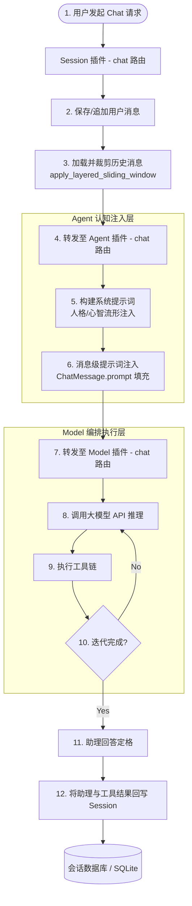

# Unified Session & Memory Orchestration Architecture (会话与记忆系统化管理架构说明书)

Session 插件是 Symbio 架构中的**会话持久化与历史编排中心**。它不仅管理静态的对话历史，更作为对话流的入口，协同 Agent 插件实现了高效的“认知注入”与“历史分层剪裁”机制。

本文档将系统性地阐述 Symbio 的会话保存、内容压缩、工具迭代限制以及发送过滤策略，说明其具体规则、参数配置及 Rust 底层实现策略。

---

## 一、 系统架构数据流图 (Architecture & Data Flow)

下列架构图展示了一个完整的“用户请求 -> Session (加载历史) -> Agent (提示词注入) -> AI (推理执行) -> 数据库持久化”的生命周期：



---

## 二、 核心参数与配置 Schema (Configuration Details)

会话与压缩系统的全部表现都由全局会话配置参数控制。以下是 `symbio.toml` (或动态 SessionConfig) 中关于会话与记忆的完整配置示例：

```yaml
session:
  # 存储目录：固定为 <homedir>/plugins/session/，从 HomedirRegistry 派生，
  # 跟随系统目录 (homedir) 切换，不再作为配置项。
  store_kind: file                         # 存储后端类型: file (文件目录) 或 sqlite (SQLite 数据库)
  default_agent_id: default_assistant      # 会话创建时的默认智能体人格 ID
  
  # 1. 存储级策略
  max_messages: 500              # 单会话本地保存的最大对话轮数限制 (以 User 消息计数)
  
  # 2. 单轮迭代策略
  max_tool_rounds: 15            # 单轮对话中大模型允许执行工具的最大迭代轮数 (防爆熔断阀)
  
  # 3. 微观内容截断策略
  compress_line_threshold: 15    # 单条消息内容行数阈值，超过该行数将触发物理脱水写盘存档
  
  # 4. 宏观语义压缩策略
  auto_compress: true            # 是否启用基于 Token 溢出 (70% 触发) 的大模型自我语义合并
  context_messages: 10           # 每次发送给 AI 的对话上下文滑动窗口轮数限制 (基于对话轮数)
  
  # 5. 工具滑动窗口策略
  tool_context_window: 15        # LLM 推理上下文中保留完整结果的最近工具调用数量限制
```

---

## 三、 五大核心策略的具体规则与 Rust 实现机制 (Implementation Strategies)

### 1. 单会话对话轮数上限存储策略 (`max_messages`)

> **目标**：防止单个会话历史由于对话轮数过多而无限膨胀，导致磁盘溢出或加载序列化变慢。

* **具体规则**：
  * 对每个 Active Session 物理存储的历史记录实施**最大保存对话轮数限制**。
  * `max_messages` 表示最大保存的对话轮数，每一轮以一个 `User` 消息起始，默认及安全下限为 `500` 轮。
  * 当存储的对话轮数超出阈值时，自动从会话开头执行 FIFO 裁剪，移除最老的多余对话轮次，且在裁剪时会自动检查并物理清理对应的本地 `.txt` 消息存档文件，防止磁盘文件泄露。
  * **智能对齐**：此策略确保物理保存下来的会话，其起始消息也总是以一个完整的 `User` 消息起始，从而绝对避免了历史反序列化对齐失败的问题。
* **Rust 实现策略**：
  * 在 `SessionPlugin::invoke_append` 中，扫描 `User` 消息索引并执行轮数对齐物理截断，确保物理存储也总是以 `User` 消息为开端：

    ```rust
    let max_turns = self.config.read().await.max_messages.max(500);
    let mut user_indices = Vec::new();
    for (idx, msg) in session.messages.iter().enumerate() {
        if msg.role == Some(MessageRole::User) {
            user_indices.push(idx);
        }
    }
    if user_indices.len() > max_turns {
        let start_idx = user_indices[user_indices.len() - max_turns];
        // 异步检查并物理删除 start_idx 之前老旧存档文件以防止磁盘泄露，然后执行截断：
        session.messages.drain(0..start_idx);
    }
    ```

---

### 2. 单轮会话工具调用迭代上限策略 (`max_tool_rounds`)

> **目标**：为自主 Agent 的多步决策设置“物理安全网”，防止由于大模型失误、死锁或命令失败导致的“天价账单死循环 (Runaway Loop)”。

* **具体规则**：
  * 在用户提交单次 Prompt 后，系统在后台开启一个自主决策（Loop）链。
  * 大模型在一个循环中可以做 `推理 -> 工具调用 -> 工具结果返回 -> 再推理 -> 再工具调用` 的迭代。
  * 该循环的连续执行迭代次数上限受 `max_tool_rounds` 严格制约（默认 `15` 轮）。
* **Rust 实现策略**：
  * 在 `ChatOrchestrator::run_chat_loop` 的主编排环中，通过获取的动态配置强制约束循环边界：

    ```rust
    for turn in 0..max_tool_rounds {
        // ...大模型推理与工具批量执行...
        if !has_more_tool_calls { break; } // 工具链执行完毕，完美退出
    }
    // 若 turn 达到 max_tool_rounds，循环强行熔断并向前端及用户发出告警通知
    ```

---

### 3. 微观消息大文本截断脱水策略 (`compress_line_threshold`)

> **目标**：保护活跃内存（Active RAM）和 LLM 发送上下文免受超大日志、超长代码文件等大文本的直接拖累，在“脱水”的同时保留追溯能力。

* **具体规则**：
  * 当单条消息的文本行数超过 `compress_line_threshold`（默认 `15` 行）时，消息体本身执行**物理脱水**：
    * 完整原文被转移写入到独立的 `.txt` 物理存档文件中。
    * 向量中仅保留该消息的**末尾 10 行**作为骨架，并注入系统级脚注以指明存档文件路径。
  * **特例保护**：对于每次对话的**最后一轮消息**（例如大模型刚刚输出的内容或刚返回的工具报错），Session 插件在读取返回时会自动执行 `decompress_message` 自动解压还原，以确保大模型和用户始终能看到最新一轮的 100% 完整细节。
* **Rust 实现策略**：
  * 在 `plugins/session/compress.rs` 中检测消息文本行数：

    ```rust
    if line_count > threshold {
        // 1. 创建物理存档文件 "messages/m_{ts}.txt" 并写入完整文本
        std::fs::write(&archive_path, &original_text)?;
        // 2. 将 ChatMessage 内存对象的 content 替换为最后 10 行骨架 + 注脚信息
        msg.content = Some(MessageContent::Text(format!("{}\n\n[Content Archived to: {}]", last_10_lines, archive_rel_path)));
    }
    ```

---

### 4. 大模型自动语义压缩策略与对话轮数对齐 (`auto_compress` / `context_messages`)

> **目标**：解决 LLM Token 绝对窗口溢出问题，通过“宏观压缩”在维持长距离记忆连贯性的同时极大降低 Token 话费。

* **具体规则**：
  * **对话轮数感知滑动窗口限制 (Dialogue Turn-Aware Sliding Window)**：
    * 每次组装上下文时，如果未指定具体的消息条数限制，系统会自动依据 `context_messages` (默认 10 轮对话) 作为滑动窗口。
    * **智能对齐**：为了避免工具调用等中间过程物理截断导致 context_messages 切碎了上一轮的 User 消息（导致 Agent 在对齐时把整段历史吞掉），Retrieval 过程会**从后往前扫描**以找到第 `context_messages` 个 `User` 消息。
    * 系统将从该 `User` 消息起点开始，返回**完整且未遭打碎的最近 $N$ 轮历史对话**。
  * **动态语义压缩**：当滑动窗口内的对话历史 Token 预估值超过大模型上下文限制的 **70%** 时，且 `auto_compress` 开启，系统将自动对老旧历史进行 LLM 语义合并。
* **Rust 实现策略**：
  * **Turn 对齐获取 (`plugins/session/plugin.rs`)**：
    * 在 `invoke_get_messages` 中实现了对 `User` 消息角色的逆向扫描与定位，保证每一次加载的历史上下文都是轮次级对齐的：

    ```rust
    // 从后往前寻找第 context_limit 个 User 消息，以其作为起点裁剪历史
    let mut user_indices = Vec::new();
    for (idx, msg) in filtered.iter().enumerate() {
        if msg.role == Some(MessageRole::User) {
            user_indices.push(idx);
        }
    }
    if user_indices.len() > context_limit {
        let start_idx = user_indices[user_indices.len() - context_limit];
        filtered.into_iter().skip(start_idx).collect()
    } else {
        filtered
    }
    ```

  * **语义合并 (`plugins/model/compression.rs`)**：
    * 每次大模型执行 Turn 之前，`prepare_compression`（配合 `should_start_compression` 的 Token 估计检测）会检测 Token 估计值。如果超标，它会将历史会话（保留最近 30% 活跃明细）打包发送给一个背景 LLM，并使用特殊的 System Prompt 提炼出高密度的 **`<state_snapshot>` XML 状态快照**：

    ```xml
    <state_snapshot>
      <completed_items>已成功重构 Session 核心，并在 symbio 中消灭了硬编码。</completed_items>
      <knowledge_discovered>Model 插件和 Agent 插件解耦，跨插件必须路由 session/config/get。</knowledge_discovered>
      <open_issues>前端 UI 还需适配并提交 tool_context_window 新字段。</open_issues>
    </state_snapshot>
    ```

  * 该快照以一条高密度的 User 消息替代被压缩的老旧历史，完美承接之前的所有意图与已知知识，将上下文开销瞬间降到最低。

---

### 5. 混合工具滑动窗口与自动历史清理策略 (`tool_context_window` / 物理存储裁剪)

> **目标**：平衡“智能体需要记住过去执行了什么以防死锁/鬼打墙”与“庞大的历史工具执行详情（如 cargo check 几百行日志）会彻底撑爆 Token 和存储文件”之间的矛盾。

* **具体规则**：
  * **推理期视界裁剪 (Inference-time Sliding Window)**：
    * 当向 LLM 发送请求时，仅保留最近 `tool_context_window`（默认 `15`）次工具调用的完整参数 and 返回明细。
    * 超出该窗口的历史老旧工具调用执行**“脱水骨架化”**：抹除所有超大 Argument 和 Output 日志，替换为轻量级运行状态足迹（如 `[System Info: Tool 'view_file' executed successfully. Output skeletonized to save context window.]`）。
  * **存储期物理裁剪 (Storage-time Physical Pruning)**：
    * 当 Session 插件持久化保存（`append`）消息时，自动以**最后一轮会话的 User 消息**作为分水岭。
    * 分水岭以前的所有历史会话中，所有的 `Action`（工具执行结果）消息和 `ToolCall`（工具意图）消息**直接物理删除**，甚至将不再包含任何子节点且内容为空的 Assistant 容器消息一并拔除。
    * **只保留最终的 Assistant 文本和推理回复**，这使得本地 Session 存储永远保持在极简、极轻的 K 字节规模。
* **Rust 实现策略**：
  * **推理过滤 (`plugins/session/context.rs`)**：

    ```rust
    // 仅在发送 API 时过滤出 filtered_messages，不修改底层物理存储数据
    let filtered_messages = apply_layered_sliding_window(&context.messages, tool_context_window);
    ```

  * **存储清理 (`plugins/session/plugin.rs`)**：
    * 在追加新消息时，调用 `prune_historical_tool_calls` 自动从物理消息数组中抹去历史工具链的所有足迹：

      ```rust
      // 1. 寻找到最后一个 User 消息索引 limit_idx 作为最新一轮会话的起点
      // 2. 扫描 messages[..limit_idx]，提取 Action 消息 ID 和 ToolCall 消息 ID 加入 to_remove 集合
      // 3. 对无文本内容的空容器 Assistant 消息一并清理
      // 4. 物理截断：
      messages.retain(|msg| !to_remove.contains(&msg.id));
      ```

---

## 四、 策略对比与总结 (Summary Matrix)

| 策略维度 | 核心控制参数 | 执行时机 | 动作目标 | 底层实现文件 |
| :--- | :--- | :--- | :--- | :--- |
| **存储级队列裁剪** | `max_messages` | `invoke_append` | 截断超出 500 条的最老消息 | `plugins/session/plugin.rs` |
| **单轮工具防爆熔断** | `max_tool_rounds` | `run_chat_loop` | 阻止单次对话中工具迭代超过 15 轮 | `plugins/model/chat_loop.rs` |
| **单消息大文本脱水** | `compress_line_threshold` | `invoke_append`<br>`compress_temporary_messages` | 物理行数超过 15 行写盘存档 | `plugins/session/compress.rs` |
| **宏观语义快照合并** | `auto_compress` | `prepare_compression` | 超过大模型 70% Token 时用 XML 状态快照合并 | `plugins/model/compression.rs` |
| **推理滑动窗口裁剪** | `tool_context_window` | 组装 LLM API 请求前 | 仅向大模型提供最近 15 轮工具明细，老旧工具骨架化 | `plugins/session/context.rs` |
| **存储历史过程清理** | 自动化执行 | `invoke_append` 保存时 | 物理删除除最后一轮外所有历史工具 `Action` / `ToolCall` 消息 | `plugins/session/plugin.rs` |

通过这套精心设计的**六维协同策略**，Symbio 实现了高保真度的会话还原、高度清爽的本地数据持久化，并在大模型面前维持了极低 Token 开销与绝对安全的行为控制屏障。
